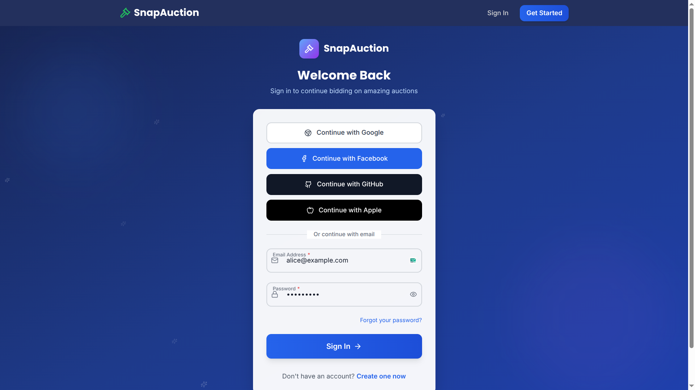
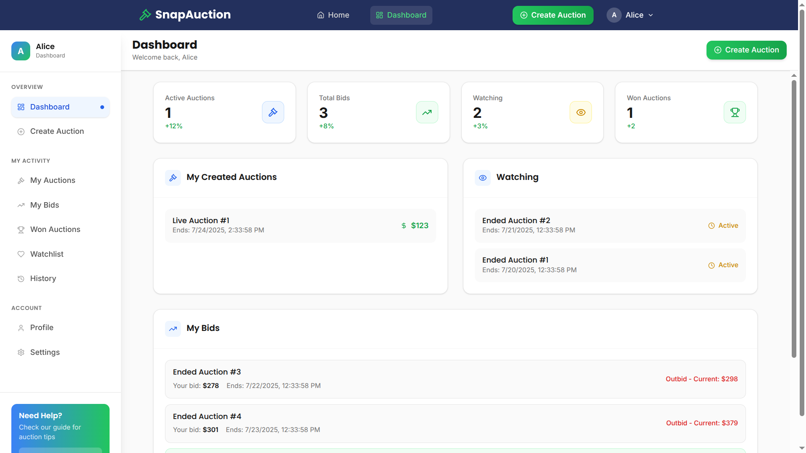
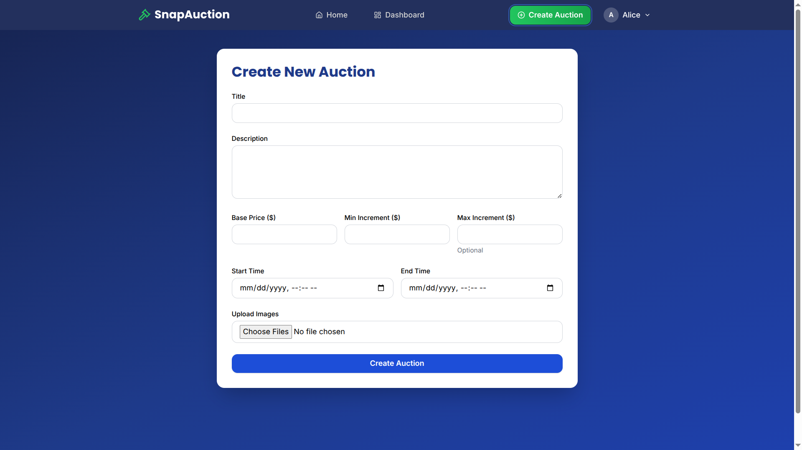

# SnapAuction

SnapAuction is a full-stack web application for real-time online auctions. This project is divided into two main parts:

- **backend/**: Node.js/Express API with Prisma ORM and PostgreSQL
- **frontend/**: React app (Vite) for the user interface

---

## Folder Structure

```
SnapAuction/
├── backend/      # Backend API, database, and business logic
├── frontend/     # Frontend React application
├── README.md     # Project root documentation (this file)
└── ...           # Other config and meta files
```

---

## Getting Started

### Prerequisites

- Node.js (v18+ recommended)
- npm or yarn
- PostgreSQL database (for backend)

### Setup

1. **Clone the repository:**
   ```bash
   git clone <repo-url>
   cd SnapAuction
   ```
2. **Install dependencies:**
   - Backend: `cd backend && npm install`
   - Frontend: `cd ../frontend && npm install`
3. **Configure environment variables:**
   - See `backend/README.md` and `frontend/README.md` for required variables.
4. **Run the applications:**
   - Backend: `npm run dev` (from `backend/`)
   - Frontend: `npm run dev` (from `frontend/`)

---

## Documentation

- [Backend Documentation](backend/README.md)
- [Frontend Documentation](frontend/README.md)

## Images

### Login Page


### Landing Page


### Dashboard Page


### Auctions Page


### Create Auction Page


